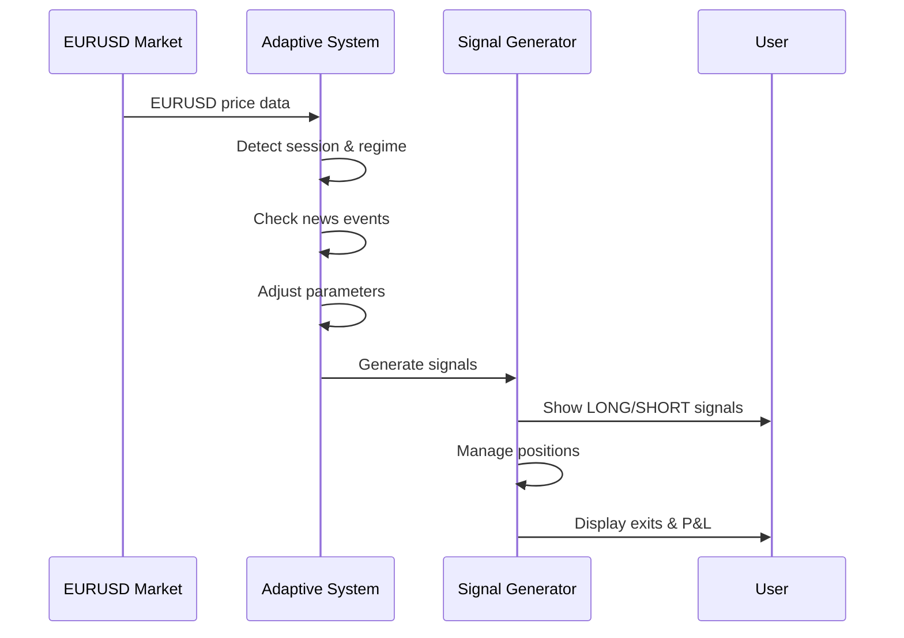
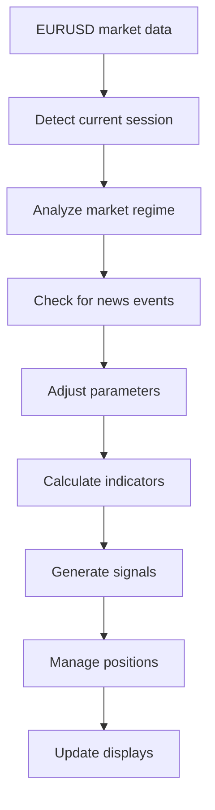

## Visual Preview

### Forexoid EURUSD Adaptive in Action

*Professional EURUSD trading signals with adaptive parameters*

## Installation

### Quick start (3 steps!)

**Detailed steps:**

1. **Copy** the Pine Script code from `Forexoid_EURUSD_Adaptive.pine`
2. **Open** TradingView and go to Pine Editor
3. **Paste** the code into the editor
4. **Click** "Add to Chart"
5. **Configure** settings for EURUSD trading

> **Tip:** The indicator works best as an overlay on EURUSD M5 charts!

## Configuration

### EURUSD Specific Settings

| Parameter | Default value | Description | Tip |
|-----------|---------------|-------------|-----|
| `Enable Session Optimization` | `true` | Auto-adjust for trading sessions | Essential for EURUSD |
| `Enable News Filter` | `true` | Filter signals during news events | Critical for EURUSD |
| `Enable Spread Optimization` | `true` | Consider EURUSD spread | EURUSD-specific |
| `Enable Multi-Timeframe` | `true` | Use H1/M15/M5 confluence | Recommended |

### Adaptive Parameters

| Parameter | Default value | Description | Tip |
|-----------|---------------|-------------|-----|
| `Enable Adaptive System` | `true` | Auto-adjust parameters | Core feature |
| `High Volatility Threshold` | `1.5` | High volatility detection | EURUSD-specific |
| `Low Volatility Threshold` | `0.8` | Low volatility detection | EURUSD-specific |
| `High Volume Threshold` | `2.0` | High volume detection | EURUSD-specific |
| `Low Volume Threshold` | `0.5` | Low volume detection | EURUSD-specific |

### Risk Management

| Parameter | Default value | Description | Tip |
|-----------|---------------|-------------|-----|
| `Max Risk Per Trade (%)` | `2.0` | Maximum risk per trade | EURUSD-optimized |
| `ATR Multiplier for Stops` | `1.5` | Stop loss multiplier | EURUSD-specific |
| `Profit Target Ratio` | `2.0` | Risk/reward ratio | EURUSD-optimized |
| `Enable Trailing Stop` | `true` | Dynamic trailing stops | Recommended |
| `Trailing Stop ATR Multiplier` | `1.0` | Trailing stop sensitivity | EURUSD-specific |

### Visual Settings

| Parameter | Default value | Description | Tip |
|-----------|---------------|-------------|-----|
| `Show Trend Line` | `true` | Display adaptive trend line | Essential |
| `Show S/R Levels` | `true` | Show support/resistance | Helpful |
| `Signal Size` | `Medium` | Label size | Adjust to preference |

> **Recommendation:** Start with default settings optimized for EURUSD M5 timeframe!

## Usage

### EURUSD trading workflow

**Step by step:**

1. **Add** Forexoid EURUSD Adaptive to your EURUSD chart
2. **Watch** for 🇪�� LONG/SHORT signals with session info
3. **Observe** adaptive parameter changes in real-time
4. **Check** the information tables for market analysis
5. **Monitor** news event warnings (🚨)
6. **Use** multi-timeframe confluence for confirmation

> **Pro tip:** EURUSD signals adapt automatically to current session and market regime!

## Technical Details

### How it works

### Signal Logic

| Signal | Condition | Action |
|--------|-----------|--------|
| **🇪🇺 LONG** | Score ≥ threshold + session optimized + regime confirmed | Green label with EURUSD theme |
| **🇪🇺 SHORT** | Score ≥ threshold + session optimized + regime confirmed | Red label with EURUSD theme |
| **🔴/🟢 EXIT** | Stop loss/Take profit/Structure change/Momentum/News | Orange exit label with P&L |

### Adaptive Parameter System

| Session | Trend Sens | Momentum Sens | Profit Target | Risk % | Threshold |
|---------|------------|---------------|---------------|--------|-----------|
| **ASIAN** | 0.8 | 0.9 | 1:1.5 | 1.0% | 7.0 |
| **EUROPEAN** | 0.6 | 0.7 | 1:2.5 | 1.5% | 6.0 |
| **AMERICAN** | 0.5 | 0.6 | 1:3.0 | 2.0% | 5.5 |
| **OVERLAP** | 0.4 | 0.5 | 1:4.0 | 2.5% | 5.0 |

### Market Regime Detection

| Regime | Characteristics | Strategy Adjustment |
|--------|-----------------|-------------------|
| **TRENDING** | Strong directional movement | Trend following parameters |
| **RANGING** | Sideways movement | Mean reversion parameters |
| **BREAKOUT** | High volatility breakouts | Breakout parameters |
| **NEUTRAL** | Unclear direction | Default parameters |

### Signal Strength Calculation

| Component | Weight | Purpose |
|-----------|--------|---------|
| **Trend H1** | 2.5 | Primary trend direction |
| **Momentum** | 2.0 | Price momentum |
| **Structure** | 1.5 | Market structure |
| **Volume** | 1.0 | Volume confirmation |
| **VWAP** | 1.0 | Price vs VWAP |
| **Volatility** | 1.0 | Volatility context |
| **Multi-TF** | 1.0 | Timeframe confluence |
| **News Filter** | 0.5 | News event protection |

### News Event Detection

- **Volatility Spike**: ATR ratio > 2.0
- **Volume Spike**: Volume > 3.0x average
- **Price Spike**: Price change > 0.2%
- **Protection**: Automatic signal filtering during news

## Multi-Timeframe Analysis

The indicator analyzes EURUSD trends across multiple timeframes:

| Timeframe | Purpose | Analysis Method |
|-----------|---------|-----------------|
| **H1** | Primary trend | EMA + Momentum analysis |
| **M15** | Structure confirmation | SMA-based trend detection |
| **M5** | Execution signals | Full adaptive analysis |

## Session-Based Optimization

### Asian Session (00:00-08:00 UTC)
- **Strategy**: Scalping
- **Characteristics**: Lower volatility, ranging movements
- **Parameters**: Higher sensitivity, smaller targets

### European Session (08:00-13:00 UTC)
- **Strategy**: Trend Following
- **Characteristics**: Medium volatility, trend movements
- **Parameters**: Balanced sensitivity, medium targets

### American Session (16:00-21:00 UTC)
- **Strategy**: Breakout Trading
- **Characteristics**: High volatility, breakout movements
- **Parameters**: Lower sensitivity, larger targets

### Overlap Session (13:00-16:00 UTC)
- **Strategy**: News Trading
- **Characteristics**: Extreme volatility, news-driven movements
- **Parameters**: Lowest sensitivity, largest targets

## Alerts

Built-in alerts for:
- **🇪🇺 LONG Alert**: "EURUSD LONG signal detected"
- **🇪�� SHORT Alert**: "EURUSD SHORT signal detected"
- **🔴/🟢 EXIT Alert**: "EURUSD position closed"
- **🚨 News Alert**: "High volatility detected"

## EURUSD-Specific Characteristics

### EURUSD Market Dynamics

| Characteristic | Value | Impact on Strategy |
|----------------|-------|-------------------|
| **Trading Hours** | 24/5 | Global market coverage |
| **Volatility** | Medium-High | Requires adaptive stops |
| **Spread** | 0.5-2 pips | Consider in calculations |
| **News Sensitivity** | High | Automatic filtering |
| **Session Overlap** | European-American | Highest volatility |

### Important EURUSD Factors

1. **ECB Policy**: European Central Bank decisions
2. **Fed Policy**: Federal Reserve decisions
3. **Economic Data**: GDP, inflation, employment
4. **Geopolitical Events**: EU-US relations
5. **Interest Rate Differentials**: EUR vs USD rates

## Warnings

### Important information before use!

| Warning | Description | Reason |
|---------|-------------|--------|
| **Market Hours** | Different characteristics per session | Parameters adapt automatically |
| **News Sensitivity** | Highly sensitive to news events | May cause rapid price movements |
| **Spread Considerations** | Consider EURUSD spread | Built-in spread optimization |
| **Risk Management** | Use appropriate position sizing | EURUSD requires careful risk management |
| **Demo Testing** | Always test on demo first | EURUSD trading has unique characteristics |

> **Golden rule:** "EURUSD trading requires understanding of European and American market dynamics!"

## Performance Expectations

### Target Metrics

| Metric | Target Value | Advantage |
|--------|--------------|-----------|
| **Win Rate** | 60-70% | Adaptive parameters |
| **Risk/Reward** | 1:2.0 | Session optimization |
| **Max Drawdown** | <15% | News filter protection |
| **Sharpe Ratio** | >1.5 | Multi-timeframe confluence |
| **Signals per Day** | 3-8 | EURUSD-specific filtering |

## Changelog

### Version 1.0 - "EURUSD Market Specialist"

| Feature | Status | Description |
|---------|--------|-------------|
| Adaptive System | ✅ | Auto-adjusting parameters for EURUSD |
| Session Optimization | ✅ | Asian/European/American/Overlap strategies |
| Market Regime Detection | ✅ | TRENDING/RANGING/BREAKOUT/NEUTRAL |
| News Event Filter | ✅ | Automatic volatility protection |
| Multi-Timeframe Analysis | ✅ | H1/M15/M5 confluence |
| Spread Optimization | ✅ | EURUSD-specific spread considerations |
| Risk Management | ✅ | EURUSD-specific risk parameters |
| Visual Clarity | ✅ | Clean labels, lines, and information tables |

> **Version 1.0 features:** Complete EURUSD trading system with adaptive intelligence, session-based optimization, market regime detection, and comprehensive risk management!

## License

### �� MIT License

**Free to use for commercial and non-commercial purposes!**

This project is licensed under the MIT License - see the [LICENSE](LICENSE) file for details.

## Author

### 👨‍💻 Forexoid Developer

**Created with 🇪🇺 EURUSD trading expertise**

| Contact | Link |
|---------|------|
| **TradingView** | [Forexoid Indicators](https://www.tradingview.com/) |
| **Support** | I welcome feedback and suggestions! |

## Support

### Need help with EURUSD trading?

**How to get help:**

1. **Read** the `EURUSD_Indicator_User_Guide.md` for detailed instructions
2. **Check** the `EURUSD_Specialized_Indicator_Functionality.md` for technical details
3. **Test** on demo account before live trading
4. **Monitor** performance and adjust parameters as needed

---

### If you like this EURUSD indicator...

**Don't forget to give it a star!** ⭐

*Every star motivates further EURUSD trading development!*

